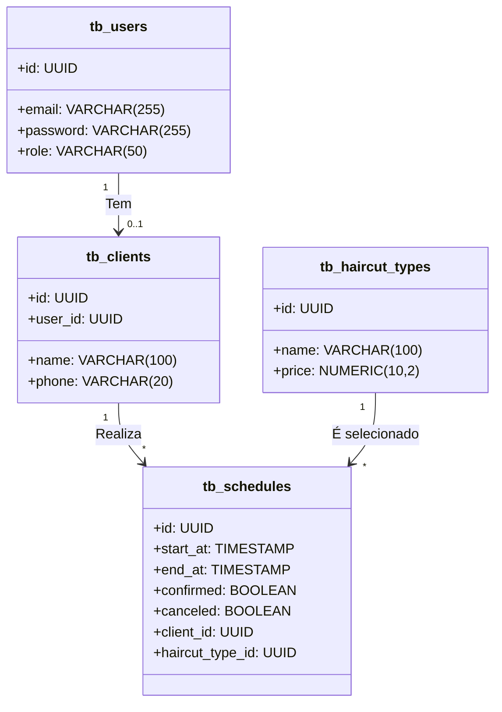

# Projeto-04-barber-shop
Projeto do Decola Tech Avanade 2025 do Barber Shop. O front end em Angular+19 e o back-end em Java Spring Boot com Postgresql e Docker


# 💈 Barber Shop - API & Frontend

Sistema completo de agendamento e gerenciamento para uma barbearia. A solução inclui um backend robusto com Spring Boot 3.2 e um frontend moderno desenvolvido com Angular 19.


---

## 📑 Índice

- [📦 Visão Geral](#visão-geral)
- [🛠️ Tecnologias Utilizadas](#tecnologias-utilizadas)
- [⚙️ Backend - Spring Boot](#backend---spring-boot)
  - [✅ Funcionalidades do Backend](#funcionalidades-do-backend)
  - [📂 Estrutura de Pastas - Backend](#estrutura-de-pastas---backend)
  - [🔐 Segurança e JWT](#segurança-e-jwt)
  - [🗂️ Diagrama de classes do Banco de dados]
  - [📊 Swagger UI](#swagger-ui)
  - [🧪 Testes e Jacoco](#testes-e-jacoco)
  - [📁 Migrations com Flyway](#migrations-com-flyway)
  - [🐳 Ambientes com Docker Compose](#ambientes-com-docker-compose)
- [💇‍♂️ Frontend - Angular 19](#barber-shop-ui-frontend)
  - [📁 Estrutura de Pastas - Frontend](#estrutura-de-pastas)
  - [⚙️ Tecnologias Utilizadas - Frontend](#tecnologias-utilizadas-1)
  - [✅ Funcionalidades Frontend](#funcionalidades)
    - [👤 Autenticação](#autenticação)
    - [🛠️ Onboarding](#onboarding)
    - [📅 Dashboard (ROLE_USER)](#dashboard-role_user)
    - [🧑‍💼 Administração (ROLE_ADMIN)](#administração-role_admin)
    - [🎨 Animações e Microinterações](#animações-e-microinterações)
  - [🔐 Segurança no Frontend](#segurança)
  - [🧠 Lógica de Agendamento](#lógica-de-agendamento)
  - [🧩 Componentes Standalone](#componentes-standalone)
- [📋 Endpoints Principais](#endpoints-principais)
- [🔐 Autenticação JWT](#autenticação-com-jwt)
- [🚀 Como Executar Localmente](#como-executar-localmente)
- [🌐 Integração com o Backend](#integração-com-o-backend)
- [📃 Licença](#licença)

---

## 📦 Visão Geral

O sistema permite que usuários agendem cortes de cabelo, enquanto administradores podem gerenciar clientes, tipos de corte, e controlar os agendamentos com filtros e confirmação.

---

## 🛠️ Tecnologias Utilizadas

### Backend

- Java 21 + Spring Boot 3.2
- Gradle 8.5
- PostgreSQL + Flyway
- JWT + Spring Security
- Swagger OpenAPI 3
- OWASP Sanitizer (HTML sanitization)
- Bucket4j (Rate Limiting)
- Jacoco (Cobertura de testes)
- Docker + Docker Compose

### Frontend (em breve)

- Angular 19 (standalone)
- Angular Material + SCSS + Bootstrap
- JWT com cookies HttpOnly + Interceptor
- Guards de Rotas + Lazy Loading + Animations
- Responsivo + UX moderna

---

## ⚙️ Backend - Spring Boot

### Funcionalidades do Backend

- ✅ Registro e login com JWT
- 🔐 Autenticação baseada em roles (`ROLE_USER`, `ROLE_ADMIN`)
- 👤 CRUD de Clientes (vinculados a usuários)
- ✂️ CRUD de Tipos de Corte (com preço)
- 📅 Agendamento de cortes com controle de horário e status
- 🔎 Filtros avançados para admin
- 🧼 Sanitização automática com OWASP Java HTML Sanitizer
- 📊 Swagger UI documentado com exemplos
- ⚠️ Rate Limiting em produção
- ✅ Testes unitários e de integração com cobertura Jacoco

### Estrutura de Pastas Backend

### Segurança e JWT

- Autenticação com JWT (Token Bearer)
- Papel padrão: `ROLE_USER`
- Usuários ADMIN têm acesso à página de administração
- Rate limit: 5 requisições por minuto por IP (exceto Swagger)

### Swagger UI

> Documentação gerada automaticamente com OpenAPI

- URL local: [http://localhost:8084/swagger-ui.html](http://localhost:8084/swagger-ui.html)
- Exemplos interativos de requisição
- Organizado por tags (Clientes, Agendamentos, Autenticação...)

---

## 🚀 Como Executar Localmente

### Pré-requisitos

- Java 21
- Docker e Docker Compose
- Node.js + Angular CLI (para frontend)

### Backend

```bash
# 1. Clone o repositório
git clone https://github.com/seu-usuario/barber-shop.git
cd barber-shop/barber-shop-api

# 2. Configure as variáveis de ambiente
cp .env.dev .env

# 3. Suba os containers
docker-compose -f docker-compose-dev.yml up

# 4. Acesse a API
http://localhost:8084/swagger-ui.html
```
--- 

## 📂 Estrutura de Pastas - Backend
```bash
barber-shop-api/
├── auth/            # Lógica de autenticação e geração de JWT
├── config/          # Configurações (CORS, Swagger, filtros, rate limiting)
├── controller/      # Controllers REST + documentação Swagger
├── entity/          # Entidades JPA (User, Client, Schedule etc.)
├── exception/       # Exceções customizadas e GlobalExceptionHandler
├── mapper/          # Mapeamentos com MapStruct + Sanitização OWASP
├── repository/      # Interfaces de repositório com Spring Data JPA
├── security/        # Configuração de segurança, JWT e filtros
├── service/         # Serviços e lógica de negócio (casos de uso)
└── resources/
    └── db/migration # Scripts de versionamento com Flyway
```
---

## 📋 Endpoints Principais

```bash
Método	Endpoint	Descrição
POST	/auth/register	Registro de novo usuário
POST	/auth/login	Login e retorno de token JWT
POST	/clients	Criação de cliente vinculado a user
GET	/schedules/month	Lista agendamentos por mês
GET	/schedules/admin-filter	Filtro avançado de agendamentos
```

---

## 🔐 Autenticação com JWT

Após o login com sucesso via /auth/login, o backend retorna um token JWT.

Esse token deve ser incluído em todas as requisições protegidas no cabeçalho HTTP:
```bash
Authorization: Bearer <SEU_TOKEN_JWT>

```
---
## 🗂️ Diagrama de Classe do Modelo ER do Banco



---
## 📌 Informações contidas no token (claims):

- sub: e-mail do usuário

- exp: data de expiração (6 horas)

- role: papel do usuário (ROLE_USER ou ROLE_ADMIN)

---

## 🧪 Testes Automatizados

- Testes com JUnit 5 e Spring Boot Test
- Cobertura de código configurada com Jacoco
- Resultados com cores e emojis no terminal
- Ambientes dev e test com configurações separadas (application-dev.yml e application-test.yml)
- Task customizada: ./gradlew test para rodar os testes
- Cobertura gerada automaticamente em build/reports/jacoco/test/html/index.html

### Cobertura de testes ( Unitários e de Integração ) dados pelo relatório do Jacoco :


---

## 💇‍♂️ Barber Shop UI (Frontend)

Frontend moderno em Angular 19 para o sistema de agendamentos de cortes de cabelo. Este projeto é totalmente standalone (sem AppModule), utiliza Angular Material, Bootstrap, animações com Angular Animations, calendário interativo e integração completa com o backend em Spring Boot.

---
## 📁 Estrutura de Pastas

```bash
src/
├── app/
│   ├── core/                # Serviços, interceptadores e guards
│   ├── pages/               # Páginas standalone: auth, onboarding, dashboard, admin
│   ├── shared/              # Componentes reutilizáveis, animações e estilos globais
│   └── app.routes.ts        # Definição das rotas principais
├── environments/            # Configurações por ambiente (dev/prod)
├── main.ts                  # Bootstrap da aplicação com providers
└── styles.scss              # Estilos globais
```
---

## ⚙️ Tecnologias Utilizadas

- Angular 19 standalone
- Angular Material com tema Azure Blue
- Bootstrap 5 para responsividade
- SCSS modularizado
- RxJS com BehaviorSubject
- Angular Animations (microinterações modernas)
- angular-calendar (calendário interativo)
- JWT Autenticação (com AuthInterceptor)
- Guards por Role (Admin/User)
- Http Interceptors para erros e loading

---

## ✅ Funcionalidades

### 👤 Autenticação

Login e registro de usuário com validações.

Armazenamento do JWT no localStorage.

Redirecionamento baseado na role (ROLE_ADMIN ou ROLE_USER).

Guardas de rota: AuthGuard, RoleUserGuard, RoleAdminGuard.

### 🛠️ Onboarding

Após o registro, o usuário é redirecionado à tela de onboarding para completar o perfil (nome e telefone).

Apenas usuários com nome e telefone preenchidos podem acessar o dashboard.

### 📅 Dashboard (ROLE_USER)

Calendário mensal com seleção de datas.

Destaca dias com lotação completa (fully-booked-day).

Escolha de horários livres de 30 em 30 minutos.

Escolha do tipo de corte (exibindo preço).

Modal de confirmação com resumo do agendamento.

### 🧑‍💼 Administração (ROLE_ADMIN)

Listagem completa de agendamentos.

Filtros por status (confirmado/cancelado), tipo de corte e intervalo de datas.

Botão para confirmação de agendamentos pendentes.

Ícones visuais indicando status do agendamento.

### 🎨 Animações e Microinterações

fadeIn, fadeInScale, slideInOut e shakeAnimation aplicados em login, registro, dashboard e transições.

LoaderComponent com overlay e spinner durante requisições HTTP.

--- 

## 🔐 Segurança

JWT interceptado automaticamente via AuthInterceptor.

HttpErrorInterceptor captura erros HTTP e exibe mensagens amigáveis com MatSnackBar.

Rotas protegidas com guards para autenticação e autorização por role.

---

## 🧠 Lógica de Agendamento

```bash
Cada dia possui limite de 18 horários (9h às 18h, com 30min de intervalo).

Dias lotados são marcados com fully-booked-day no calendário.

Após seleção de data e hora, abre-se um modal para confirmação.

Ao confirmar, o agendamento é enviado ao backend com clientId, startAt, endAt e haircutTypeId.
````

---

## 📦 Instalação e Execução Local

```bash
# Instale as dependências
npm install

# Rode o projeto localmente (Angular CLI)
ng serve

```
- O frontend estará disponível em: http://localhost:4200


---

## 🌐 Integração com o Backend

Certifique-se de que o backend esteja rodando em http://localhost:8084 ou ajuste a URL em:

```bash
// src/environments/environment.ts
export const environment = {
  production: false,
  apiUrl: 'http://localhost:8084',
};

```

---
## 📃 Licença

- Este projeto é licenciado sob os termos da MIT License – sinta-se livre para usar, modificar e compartilhar.


